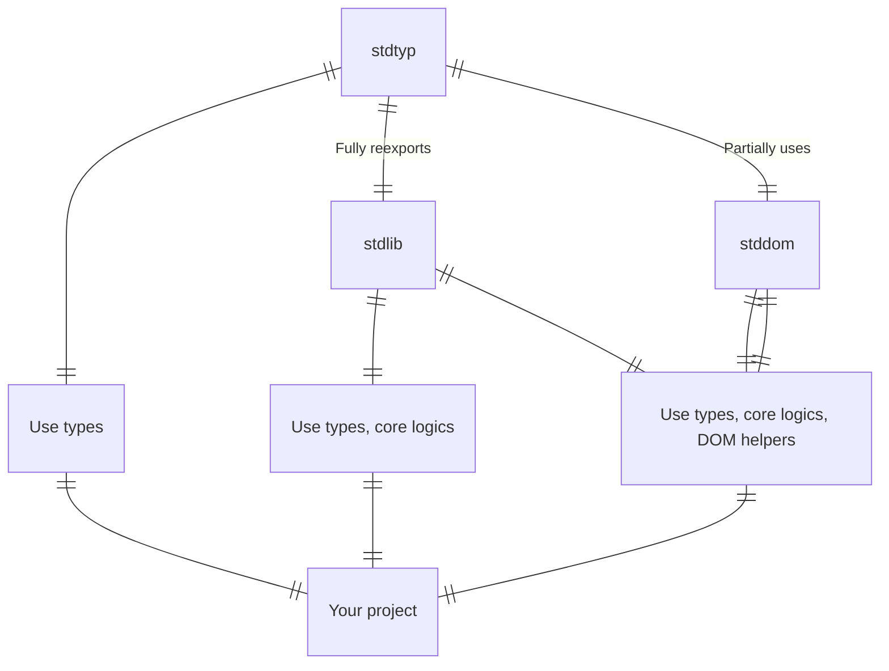

# ⛩️ Webshrine

### 💿 Usage

<details><summary>Usage variants graph</summary>



</details>

```bash
pnpm i @webshrine/stdlib # types, core
pnpm i -D @webshrine/stdtyp # types
pnpm i @webshrine/stdlib @webshrine/stddom # types, core, DOM
```
<details open><summary>Other package managers</summary>

#### NPM
```bash
npm i @webshrine/stdlib # types, core
npm i -D @webshrine/stdtyp # types
npm i @webshrine/stdlib @webshrine/stddom # types, core, DOM
```

#### Yarn
```bash
yarn add @webshrine/stdlib # types, core
yarn add -D @webshrine/stdtyp # types
yarn add @webshrine/stdlib @webshrine/stddom # types, core, DOM
```
</details>

### 📦 Unites third-party packages
- **lodash** - famous utils lib
- **type-utilities** - famous type utils lib
- **eventemitter3** - well-known EventEmitter
- **lodash-omitdeep** - recursive lodash.omit
- **klona** - fastest lodash.cloneDeep util
- **clsx** - CSS class merging helper

## 🚫 (MOVE TO DOCS)
### 📏 Rules

#### FnCompare
- must return -1 | 0 | 1

#### FnGuard
- has one parameter
- type must be assigned via "as" keyword (e.g. `(arrow-function) as FnGuard<MyType>`)

#### FnMatch
- has two parameter

#### FnTransform
- must return value

#### FnFormat
- the same as FnTransform, but may return null as a result of failed argument transformation

### 📝 Code style

#### FnGuard, FnMatch
- name starts with "is" (e.g `isString`, `isEqual`)

#### FnReduce
- name starts with "reduce" (e.g `reduceNumbersToSumNumber`)

#### FnCompare
- name starts with "compare" (e.g `compareNumber`)

#### FnTransform
- if it's a function, that executes recursively, should be named by '(name)Deep' pattern (e.g `omitDeep`)
- if it's a function, that accepts executor callback, should be named by '(name)By' pattern (e.g `omitBy`)
- if it's a cloning method, should be named by 'to(Name)ed' pattern (e.g `Array.prototype.toSpliced()`)
