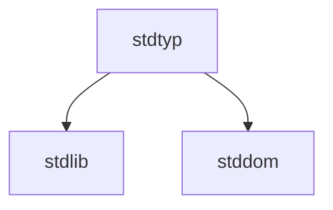

# Webshrine

### Packages relations

### Unites packages
- lodash
- lodash-omitdeep
- eventemitter3
- klona
- type-utilities
- clsx

### Rules

#### FnCompare
- must return -1 | 0 | 1

#### FnGuard
- has one parameter
- type must be assigned via "as" keyword (e.g. `(arrow-function) as FnGuard<MyType>`)

#### FnMatch
- has two parameter

export type FnTransform<Input = any, Output = Input> = Fn<[input: Input], Output>

export type FnFormat<Input, Output> = FnTransform<Input, Output | null>
#### FnTransform
- has one parameter
- must return value

#### FnFormat
- don't have to mutate argument
- the same as FnTransform, but may return null as a result of failed argument transformation

### Code style

#### FnGuard, FnMatch
- name starts with "is" (e.g `isString`, `isEqual`)

#### FnReduce
- name starts with "reduce" (e.g `reduceNumbersToSumNumber`)

#### FnCompare
- name starts with "compare" (e.g `compareNumber`)

#### FnTransform
- if it's a function, that executes recursively, should be named by '(name)Deep' pattern (e.g `omitDeep`)
- if it's a function, that accepts executor callback, should be named by '(name)By' pattern (e.g `omitBy`)
- if it's a cloning method, should be named by 'to(Name)ed' pattern (e.g `Array.prototype.toSpliced()`)
