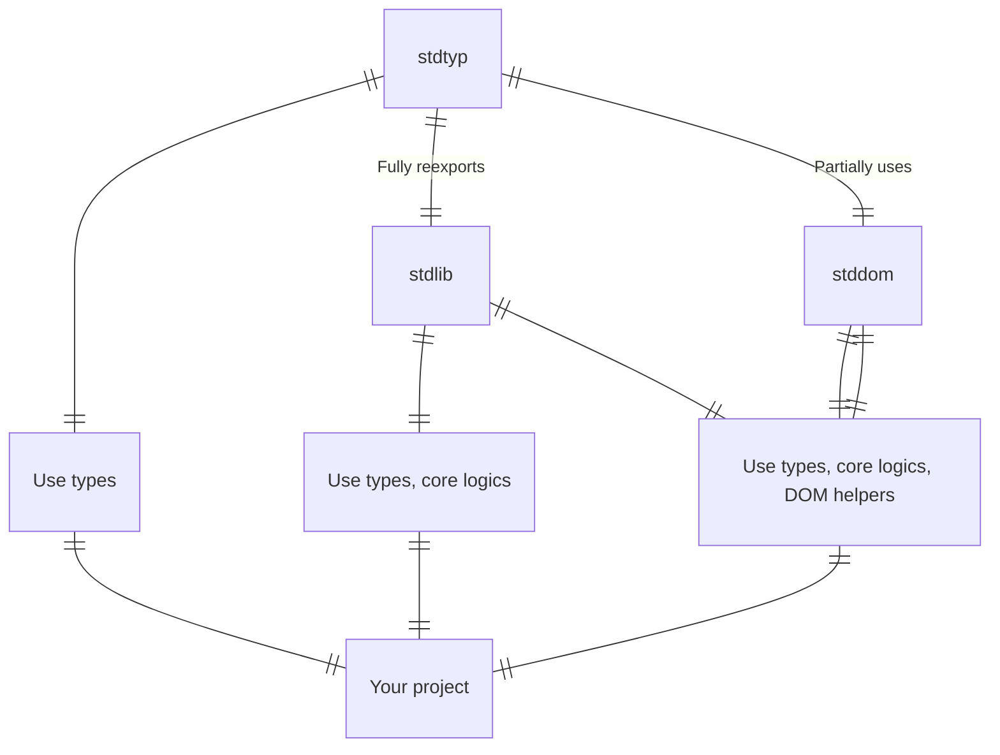

# ⛩️ Webshrine

> [!IMPORTANT]
> WIP - This project is currently not ready for use!

### 💿 Usage

<details><summary>Usage variants graph</summary>



</details>

```bash
pnpm i @webshrine/stdlib # types, core
pnpm i -D @webshrine/stdtyp # types
pnpm i @webshrine/stdlib @webshrine/stddom # types, core, DOM
```
<details><summary>Other package managers</summary>

#### NPM
```bash
npm i @webshrine/stdlib # types, core
npm i -D @webshrine/stdtyp # types
npm i @webshrine/stdlib @webshrine/stddom # types, core, DOM
```

#### Yarn
```bash
yarn add @webshrine/stdlib # types, core
yarn add -D @webshrine/stdtyp # types
yarn add @webshrine/stdlib @webshrine/stddom # types, core, DOM
```
</details>

### 📦 Unites third-party packages
- [lodash](https://www.npmjs.com/package/lodash) - famous utils lib
- [utility-types](https://www.npmjs.com/package/utility-types) - famous type utils lib
- [eventemitter3](https://www.npmjs.com/package/eventemitter3) - well-known EventEmitter
- lodash-omitdeep - recursive lodash.omit
- [klona](https://www.npmjs.com/package/klona) - fastest lodash.cloneDeep util
- [clsx](https://www.npmjs.com/package/clsx) - CSS class merging helper
