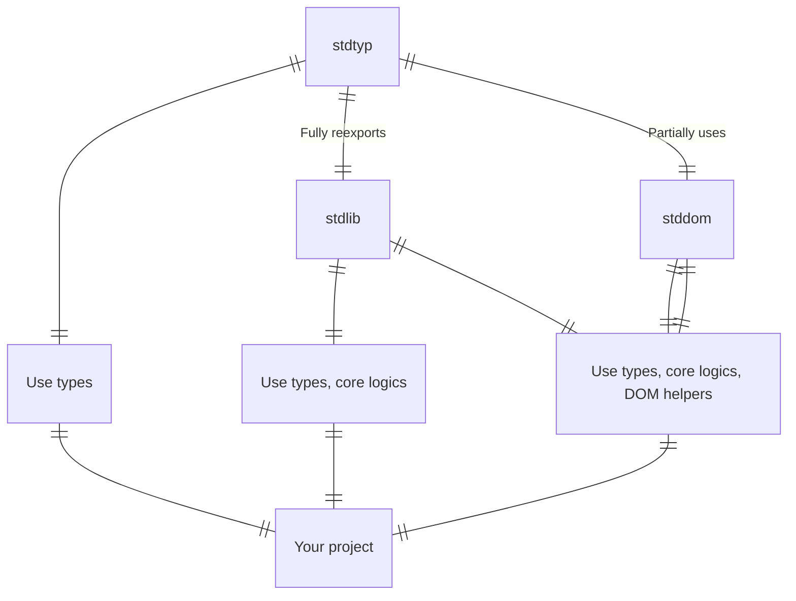

# Installation

```bash
pnpm i @webshrine/stdlib # types, core
pnpm i -D @webshrine/stdtyp # types
pnpm i @webshrine/stdlib @webshrine/stddom # types, core, DOM
```
<details><summary>Other package managers</summary>

#### NPM
```bash
npm i @webshrine/stdlib # types, core
npm i -D @webshrine/stdtyp # types
npm i @webshrine/stdlib @webshrine/stddom # types, core, DOM
```

#### Yarn
```bash
yarn add @webshrine/stdlib # types, core
yarn add -D @webshrine/stdtyp # types
yarn add @webshrine/stdlib @webshrine/stddom # types, core, DOM
```
</details>


